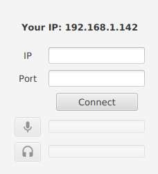

# Audio chat

One-to-one audio chat on local network using UDP protocol.

Connect with your partner using each other's local IP addresses and a common port by choice.

> *This project was my homework from "Basics of Network Programming" subject in the university*